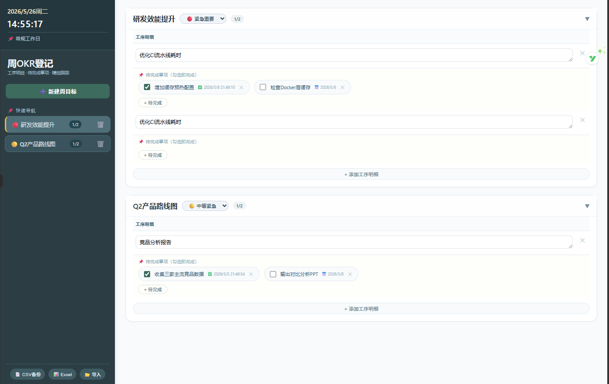

# 📋 Weekly OKR Tracker – Unpack Your Messy Workload

> A pure front-end, three-level task management tool that helps you track every small action across multiple parallel tasks without missing a thing.

## 📌 Why This Tool Exists

A colleague quit and then came back. During a chat, he joked bitterly:

> "My job now is like a compressed package – unzip it and you find multiple兼职 roles inside. Juggling so many things, I no longer have any deep professional expertise."

When multitasking, the biggest fear isn't not finishing – it's **forgetting what you've done**, missing a confirmation, or stepping into the same pitfall again.

So I built this **OKR planner** by hand.

It’s not just another to-do list. It’s a workstation that helps you keep every single piece of work under control.

---

## 🚀 Key Features

### ✅ Three-Level Breakdown Structure

Weekly Goal (Project)
└── Process Details (Tasks)
└── To-Do Items (multiple, each independently checkable)

### ✅ Independent Checkboxes for Every To-Do
- Check it → automatically records completion time  
- Uncheck it → completion time is cleared  
- **Every small action is clearly tracked**

### ✅ Auto-collapse When Completed
When all to-dos under a process detail are done, the corresponding project card **automatically collapses** – visually clean, with a great sense of accomplishment.

### ✅ Right-click Rename + Priority Labels
- **Right-click** a project name in the left sidebar to rename it  
- Each project can be labelled with one of three priorities:  
  🔴 Urgent & Important / 🟡 Moderately Urgent / 🟢 Not Urgent

### ✅ One-click Export Reports
- **📊 Excel Export**: only four columns – Weekly Goal, Process Detail, To-Do Item, Status (Completed / Not Completed)  
  Paste directly into your weekly report – your boss will think you're using some high-end system.
- **📄 CSV Backup**: contains full timestamps (creation time, completion time) for long-term archiving.

### ✅ 100% Local Storage – Private & Secure
- All data is saved in your browser's **localStorage**  
- No server, no account, no tracking  
- Export CSV backups to archive or migrate data anytime.

---

## 🖼️ Preview

> (Insert a screenshot or GIF here to show the tool in action)

*Left sidebar for project list + right side card-style board. Under each project you can expand process details and to-do items.*

---

## 💻 How to Use

### Option 1: Run Locally (Simplest)
1. Download the `index.html` file  
2. Double-click to open it in your browser  
3. Start using it (data is automatically saved on your computer)

### Option 2: Deploy to GitHub Pages / Vercel (Online Access)
1. Rename the HTML file to `index.html` (make sure the filename is exactly `index.html`)  
2. Upload it to a GitHub repository  
3. Enable GitHub Pages (Settings → Pages → Branch: main → Save)  
4. Visit `https://your-username.github.io/your-repo-name/`

> 📖 Detailed deployment guide below.

---

## 🔧 How to Deploy to GitHub Pages

1. Log in to GitHub and create a **Public** repository  
2. Drag and drop the `index.html` file into the repository  
3. Go to repository **Settings → Pages**  
   - Source: `Deploy from a branch`  
   - Branch: `main`, folder: `/ (root)`  
   - Click **Save**  
4. Wait 1–2 minutes, then visit `https://your-username.github.io/your-repo-name/`

> ⚠️ If you see a file list instead of the tool interface, it means you didn't rename the HTML file to `index.html`. Rename it and upload again.

---

## 📦 Data Backup & Migration

- **Backup**: Click the 「📄 CSV Backup」button at the bottom of the tool, save the file locally or to cloud storage  
- **Restore**: Click 「📂 Import」and select a previously exported JSON backup (note: import will overwrite existing data)

> The CSV export contains all fields so you can analyse the data in Excel.

---

## 🎨 Customisation (For Those Familiar with HTML/CSS)

This project is a **single HTML file** – feel free to modify it:
- Change colours, fonts, spacing: edit the `<style>` section  
- Adjust functionality: edit the `<script>` section  
- Add fields (e.g. estimated hours, assignee): modify the data structure and rendering code

No build tools, no dependencies – save and you're done.

---

## ❤️ Acknowledgements & Vision

This tool is for everyone suffering from "compressed package work" –  
It's not your fault that you have a million things to do.  
But you can choose a more satisfying way to break them down, check them off, and archive them.

Every little checkmark is a commitment you make to yourself.

---

## 📜 License

MIT License – free to use, modify, and share.

---

## 🤝 Feedback & Suggestions

If you have ideas for improvement, feel free to open an Issue or submit a Pull Request.  
If this tool helps you, please give it a ⭐️ so more people can find it.

**Work is tough, but we can make it clearer.**

# 📋 周OKR登记 —— 把“压缩包”工作拆得一清二楚

> 一个纯前端、三级拆解的任务管理工具，帮你在多线任务中不漏掉任何一个小动作。

## 📌 为什么会有这个工具？

身边有同事辞职后又返岗，闲聊时他苦笑着说：

> “现在的工作内容简直就是个压缩包，一打开全是兼职。身兼多职久了，已经没有深度专业能力可言。”

多线任务同步推进，最怕的不是做不完，而是 **明明做过的事，转身就忘了** —— 漏了某个细节、忘了确认进度、回头发现坑还在那里。

于是，我手搓了这样一个 **OKR 规划表**。

**它不是又一个简单的清单，而是一个能让你把每件破事儿都盯死的工作台。**

---

## 🚀 核心功能

### ✅ 三级穿透结构

周目标（项目）
└── 工序明细
└── 待完成事项（可多个，独立打勾）

### ✅ 每个待办独立勾选
- 打勾 ➜ 自动记录完成时间  
- 取消打勾 ➜ 完成时间自动清空  
- **每个小动作都清清楚楚**

### ✅ 全部完成 ➜ 自动折叠
当一个工序下的所有待办都完成，对应的项目卡片会 **自动折叠**，视觉清爽，成就感拉满。

### ✅ 右键重命名 + 优先级标签
- 左侧项目名称上 **右键** 即可改名  
- 每个项目可设置三档优先级：  
  🔴 紧急重要 / 🟡 中等紧急 / 🟢 不紧急

### ✅ 一键导出报表
- **📊 Excel 导出**：仅四列 —— 周目标、工序明细、待完成事项、是否完成  
  直接粘贴到周报，老板看了以为你用了高端系统。
- **📄 CSV 备份**：包含完整时间戳（创建时间、完成时间），方便长期归档。

### ✅ 纯本地存储，隐私安全
- 所有数据保存在你浏览器的 **localStorage** 中  
- 无服务器、无账号、无追踪  
- 支持导出 CSV 备份，可自行存档或迁移

---

## 🖼️ 界面预览

> （建议在此处插入截图或动图，展示工具实际效果）

*左侧项目列表 + 右侧卡片式看板，每个项目下可展开工序和待办事项。*

---

## 💻 如何使用

### 方式一：本地直接运行（最简单）
1. 下载 `index.html` 文件  
2. 双击用浏览器打开  
3. 开始使用（数据会自动保存在你的电脑中）

### 方式二：部署到 GitHub Pages / Vercel（在线访问）
1. 将 `index.html` 重命名为 `index.html`（确保文件名正确）  
2. 上传到 GitHub 仓库  
3. 开启 GitHub Pages（Settings → Pages → Branch: main → Save）  
4. 访问 `https://你的用户名.github.io/你的仓库名/`

> 📖 详细部署指南见后文。

---

## 🔧 如何部署到 GitHub Pages

1. 登录 GitHub，新建一个 **Public** 仓库  
2. 将本项目的 `index.html` 文件拖拽上传  
3. 进入仓库 **Settings → Pages**  
   - Source 选择 `Deploy from a branch`  
   - Branch 选择 `main`，文件夹选 `/ (root)`  
   - 点击 **Save**  
4. 等待 1-2 分钟，访问 `https://你的用户名.github.io/你的仓库名/` 即可

> ⚠️ 如果看到的是文件列表而不是工具界面，说明你没有把 HTML 文件命名为 `index.html`。请重命名后重新上传。

---

## 📦 数据备份与迁移

- **备份**：点击工具底部的「📄 CSV备份」，保存文件到本地或网盘  
- **恢复**：点击「📂 导入」，选择之前备份的 JSON 文件（注意：导入会覆盖现有数据）

> CSV 导出包含所有字段，方便你用 Excel 二次分析。

---

## 🎨 自定义修改（懂 HTML/CSS 的朋友）

本项目是一个**单 HTML 文件**，你可以随意修改：
- 修改颜色、字体、间距：编辑 `<style>` 部分  
- 调整功能逻辑：编辑 `<script>` 部分  
- 增加字段（如预估工时、负责人）：修改数据结构和渲染代码

没有构建工具，没有依赖，改完保存即生效。

---

## ❤️ 致谢与愿景

这个工具送给所有被“压缩包工作”折磨的人 ——  
事情真他爷的多，不是你的错。  
但你可以选择，用一种更爽的方式，把它们拆碎、打勾、归档。

每个待办事项上的那个小勾，都是你对自己的一次交代。

---

## 📜 许可证

MIT License，随意使用、修改、分享。

---

## 🤝 反馈与建议

如果你有任何改进想法，欢迎提 Issue 或直接修改代码。  
如果这个工具帮到了你，请给它一个 ⭐️，让更多人看到。

**工作很苦，但我们可以让它清晰一点。**
